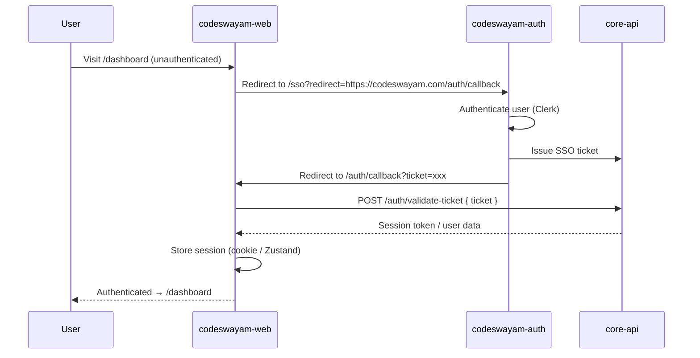

# codeswayam-web


> **The public marketing website, blog, and product showcase for the CodeSwayam platform.**

---

## Table of Contents

- [Overview](#overview)
- [Architecture](#architecture)
- [Tech Stack](#tech-stack)
- [App Routes](#app-routes)
- [Middleware](#middleware)
- [SEO System](#seo-system)
- [PWA Support](#pwa-support)
- [Component Inventory](#component-inventory)
- [Code Examples](#code-examples)
- [Environment Variables](#environment-variables)
- [Getting Started](#getting-started)

---

## Overview

`codeswayam-web` is the **public face of the CodeSwayam platform** — the first thing potential customers, developers, and learners see. It is a performance-first, SEO-first marketing site that drives acquisition across all CodeSwayam products.

This is not just a static brochure site. It handles:

- 📣 **Marketing** — Hero sections, product showcases, feature highlights, social proof, pricing, and CTAs
- 📝 **Blog** — Long-form content for SEO, education, and community building
- 🔍 **SEO Infrastructure** — JSON-LD structured data, dynamic sitemaps, robots.txt, and Open Graph metadata baked into every page
- 📲 **PWA** — Installable app with service worker for offline support and fast repeat visits
- 🔒 **Protected Dashboard** — A lightweight authenticated dashboard surface, authenticated via SSO callback from `codeswayam-auth`
- 📊 **Analytics** — First-party analytics integration via `@codeswayam/analytics`

**Design philosophy:** Every page is a landing page. Every route is indexable. Performance and Core Web Vitals are non-negotiable.

---

## Architecture

```
┌────────────────────────────────────────────────────────────────────────┐
│                          codeswayam-web :3001                          │
│                                                                        │
│  ┌──────────────────────────────────────────────────────────────────┐  │
│  │                     Next.js App Router                           │  │
│  │                                                                  │  │
│  │  ┌──────────────────────┐   ┌──────────────────────────────────┐ │  │
│  │  │   (marketing) group  │   │        (blog) group              │ │  │
│  │  │                      │   │                                  │ │  │
│  │  │  /          Home     │   │  /blog          Blog listing     │ │  │
│  │  │  /pricing   Pricing  │   │  /blog/[slug]   Post detail      │ │  │
│  │  │  /about     About    │   └──────────────────────────────────┘ │  │
│  │  │  /products  Products │                                        │  │
│  │  │  /services  Services │   ┌──────────────────────────────────┐ │  │
│  │  └──────────────────────┘   │        Protected Routes          │ │  │
│  │                             │                                  │ │  │
│  │  ┌──────────────────────┐   │  /dashboard     User dashboard   │ │  │
│  │  │    API Routes        │   │  /auth/callback SSO callback     │ │  │
│  │  │  /api/*              │   └──────────────────────────────────┘ │  │
│  │  └──────────────────────┘                                        │  │
│  │                                                                  │  │
│  │  ┌──────────────────────┐   ┌──────────────────────────────────┐ │  │
│  │  │  /sitemap.ts         │   │  /robots.ts                      │ │  │
│  │  │  (dynamic sitemap)   │   │  (robots.txt)                    │ │  │
│  │  └──────────────────────┘   └──────────────────────────────────┘ │  │
│  └──────────────────────────────────────────────────────────────────┘  │
│                                                                        │
│  ┌──────────────────┐  ┌─────────────────┐  ┌──────────────────────┐  │
│  │  Edge Middleware  │  │  Service Worker │  │  @codeswayam/        │  │
│  │  withCSWAuth()    │  │  public/sw.js   │  │  analytics           │  │
│  └──────────────────┘  └─────────────────┘  └──────────────────────┘  │
└───────────────────────────────────┬────────────────────────────────────┘
                                    │
              ┌─────────────────────┼──────────────────────┐
              │                     │                      │
              ▼                     ▼                      ▼
   ┌──────────────────┐  ┌─────────────────────┐  ┌──────────────────┐
   │ codeswayam-auth  │  │  codeswayam-core-api │  │  CDN / Edge      │
   │ :3003 (SSO)      │  │  (content, products) │  │  (static assets) │
   └──────────────────┘  └─────────────────────┘  └──────────────────┘
```

### Authentication Flow (SSO Callback)



---

## Tech Stack

| Package | Version | Purpose |
|---|---|---|
| `next` | 16.x | App framework, RSC, edge middleware, ISR |
| `react` | 19.x | UI rendering |
| `typescript` | 5.x | Type safety |
| `@codeswayam/auth` | 2.5.1 | Internal: SSO validation, `withCSWAuth` middleware helper |
| `@codeswayam/api-client` | latest | Internal: Typed HTTP client for core-api |
| `@codeswayam/neural` | latest | Internal: AI/ML feature utilities |
| `@codeswayam/ui` | latest | Internal: Shared component library |
| `@codeswayam/analytics` | latest | Internal: First-party event tracking |
| `framer-motion` | latest | Animations — hero, scroll reveals, page transitions |
| `embla-carousel-react` | latest | Touch-friendly testimonial and product carousels |
| `zod` | latest | Runtime schema validation (forms, API responses) |
| `react-hook-form` | latest | Performant form state management |
| `zustand` | latest | Lightweight client state (auth session, UI state) |
| `tailwindcss` | v4 | Utility-first styling |

---

## App Routes

### Route Groups

The app uses Next.js route groups to co-locate related pages and share layouts without affecting the URL structure.

| Route | Group | Protection | Description |
|---|---|---|---|
| `/` | `(marketing)` | Public | Home — hero, features, social proof, CTA |
| `/pricing` | `(marketing)` | Public | Pricing tiers and plan comparison |
| `/about` | `(marketing)` | Public | Company story, team, mission |
| `/products` | `(marketing)` | Public | Product showcase and feature details |
| `/tools` | `(marketing)` | Public | Central Free Tools Directory — cross-domain links to PixelForge & PDFCraft |
| `/services` | `(marketing)` | Public | Services and consulting offering |
| `/blog` | `(blog)` | Public | Blog index — latest posts, categories |
| `/blog/[slug]` | `(blog)` | Public | Individual blog post with structured data |
| `/dashboard` | root | 🔒 Protected | Authenticated user dashboard |
| `/auth/callback` | root | Public | SSO callback — validates ticket, establishes session |
| `/api/*` | root | Varies | API route handlers |
| `/sitemap.ts` | root | Public | Dynamically generated XML sitemap |
| `/robots.ts` | root | Public | Dynamically generated robots.txt |

### Route Details

**`/auth/callback`** — This route is the landing point after SSO. It receives the `?ticket=` query param from `codeswayam-auth`, validates it with the core API, and stores the resulting session. It then redirects the user to their original intended destination (preserved in state or cookie before the SSO redirect).

**`/sitemap.ts`** — Fetches all blog post slugs, product pages, and static routes from the core API and generates a fully populated XML sitemap at build time with ISR revalidation.

---

## Middleware

The middleware uses `withCSWAuth()` from `@codeswayam/auth` to apply the platform's standard auth wrapper. Most routes on this site are public — the middleware only activates protection for the dashboard and admin areas.

```typescript
// middleware.ts
import { withCSWAuth } from "@codeswayam/auth";

export default withCSWAuth({
  // Routes that require authentication
  protectedPaths: ["/dashboard", "/admin"],

  // All other paths are public — no auth check
  publicPaths: [
    "/",
    "/blog",
    "/blog/(.*)",
    "/pricing",
    "/about",
    "/contact",
    "/products",
    "/products/(.*)",
    "/services",
    "/api/(.*)",
    "/auth/callback",
    "/sitemap.xml",
    "/robots.txt",
  ],

  // Where to send unauthenticated users who hit a protected route
  authUrl: process.env.NEXT_PUBLIC_APP_AUTH_URL!,

  // The SSO callback path on this app
  callbackPath: "/auth/callback",
});

export const config = {
  matcher: [
    "/((?!_next/static|_next/image|favicon.ico|.*\\.(?:svg|png|jpg|jpeg|gif|webp)$).*)",
  ],
};
```

### withCSWAuth Internals

`withCSWAuth` is a thin wrapper that:

1. Checks for a valid session token (cookie or Authorization header)
2. If valid → passes the request through with user context injected into headers
3. If invalid and path is protected → redirects to `authUrl/sso?redirect=<current-url>`
4. If invalid and path is public → passes through

---

## SEO System

SEO is a first-class concern. Every page has structured metadata, and the shared infrastructure in `lib/` makes it trivial to add new pages with full SEO coverage.

### Metadata Generator (`lib/seo.ts`)

```typescript
// lib/seo.ts
import type { Metadata } from "next";

interface SeoOptions {
  title: string;
  description: string;
  path: string;
  image?: string;
  noIndex?: boolean;
  keywords?: string[];
}

const BASE_URL = "https://codeswayam.com";
const DEFAULT_OG_IMAGE = `${BASE_URL}/og-default.png`;

export function generateMetadata({
  title,
  description,
  path,
  image = DEFAULT_OG_IMAGE,
  noIndex = false,
  keywords = [],
}: SeoOptions): Metadata {
  const url = `${BASE_URL}${path}`;
  const fullTitle = `${title} | CodeSwayam`;

  return {
    title: fullTitle,
    description,
    keywords: ["CodeSwayam", "coding platform", "learn to code", ...keywords],
    authors: [{ name: "CodeSwayam" }],
    metadataBase: new URL(BASE_URL),
    alternates: { canonical: url },
    robots: noIndex
      ? { index: false, follow: false }
      : { index: true, follow: true, googleBot: { index: true, follow: true } },
    openGraph: {
      title: fullTitle,
      description,
      url,
      siteName: "CodeSwayam",
      images: [{ url: image, width: 1200, height: 630, alt: title }],
      type: "website",
    },
    twitter: {
      card: "summary_large_image",
      title: fullTitle,
      description,
      images: [image],
      creator: "@codeswayam",
    },
  };
}
```

**Usage in a page:**

```typescript
// app/(marketing)/pricing/page.tsx
import { generateMetadata as genMeta } from "@/lib/seo";

export const metadata = genMeta({
  title: "Pricing",
  description: "Simple, transparent pricing for every stage of your coding journey.",
  path: "/pricing",
  keywords: ["pricing", "plans", "subscription"],
});

export default function PricingPage() {
  return <PricingContent />;
}
```

### JSON-LD Structured Data (`lib/json-ld.ts`)

```typescript
// lib/json-ld.ts

export function organizationJsonLd() {
  return {
    "@context": "https://schema.org",
    "@type": "Organization",
    name: "CodeSwayam",
    url: "https://codeswayam.com",
    logo: "https://codeswayam.com/logo.png",
    sameAs: [
      "https://twitter.com/codeswayam",
      "https://github.com/codeswayam",
      "https://linkedin.com/company/codeswayam",
    ],
    contactPoint: {
      "@type": "ContactPoint",
      contactType: "customer support",
      email: "support@codeswayam.com",
    },
  };
}

export function productJsonLd(product: {
  name: string;
  description: string;
  url: string;
  image: string;
}) {
  return {
    "@context": "https://schema.org",
    "@type": "SoftwareApplication",
    name: product.name,
    description: product.description,
    url: product.url,
    image: product.image,
    applicationCategory: "DeveloperApplication",
    operatingSystem: "Web",
    offers: {
      "@type": "Offer",
      priceCurrency: "INR",
      price: "0",
      priceValidUntil: new Date(Date.now() + 365 * 24 * 60 * 60 * 1000).toISOString().split("T")[0],
    },
  };
}

export function blogPostJsonLd(post: {
  title: string;
  description: string;
  url: string;
  image: string;
  datePublished: string;
  dateModified: string;
  authorName: string;
}) {
  return {
    "@context": "https://schema.org",
    "@type": "BlogPosting",
    headline: post.title,
    description: post.description,
    image: post.image,
    url: post.url,
    datePublished: post.datePublished,
    dateModified: post.dateModified,
    author: {
      "@type": "Person",
      name: post.authorName,
    },
    publisher: {
      "@type": "Organization",
      name: "CodeSwayam",
      logo: {
        "@type": "ImageObject",
        url: "https://codeswayam.com/logo.png",
      },
    },
  };
}

export function faqJsonLd(faqs: { question: string; answer: string }[]) {
  return {
    "@context": "https://schema.org",
    "@type": "FAQPage",
    mainEntity: faqs.map(({ question, answer }) => ({
      "@type": "Question",
      name: question,
      acceptedAnswer: {
        "@type": "Answer",
        text: answer,
      },
    })),
  };
}
```

**Injecting JSON-LD into a page:**

```tsx
// app/(marketing)/page.tsx
import { organizationJsonLd, faqJsonLd } from "@/lib/json-ld";

export default function HomePage() {
  return (
    <>
      {/* Inject structured data into <head> */}
      <script
        type="application/ld+json"
        dangerouslySetInnerHTML={{ __html: JSON.stringify(organizationJsonLd()) }}
      />
      <script
        type="application/ld+json"
        dangerouslySetInnerHTML={{
          __html: JSON.stringify(
            faqJsonLd([
              {
                question: "What is CodeSwayam?",
                answer: "CodeSwayam is an all-in-one platform for learning and building with code.",
              },
              {
                question: "Is there a free plan?",
                answer: "Yes, CodeSwayam offers a generous free tier with access to core features.",
              },
            ])
          ),
        }}
      />
      <HeroSection />
      {/* ... rest of page */}
    </>
  );
}
```

### Dynamic Sitemap (`app/sitemap.ts`)

```typescript
// app/sitemap.ts
import type { MetadataRoute } from "next";
import { apiClient } from "@codeswayam/api-client";

const BASE_URL = "https://codeswayam.com";

export const revalidate = 3600; // Regenerate every hour

export default async function sitemap(): Promise<MetadataRoute.Sitemap> {
  // Static marketing pages
  const staticRoutes: MetadataRoute.Sitemap = [
    { url: BASE_URL, lastModified: new Date(), changeFrequency: "weekly", priority: 1.0 },
    { url: `${BASE_URL}/pricing`, lastModified: new Date(), changeFrequency: "weekly", priority: 0.9 },
    { url: `${BASE_URL}/about`, lastModified: new Date(), changeFrequency: "monthly", priority: 0.7 },
    { url: `${BASE_URL}/products`, lastModified: new Date(), changeFrequency: "weekly", priority: 0.8 },
    { url: `${BASE_URL}/services`, lastModified: new Date(), changeFrequency: "monthly", priority: 0.7 },
    { url: `${BASE_URL}/blog`, lastModified: new Date(), changeFrequency: "daily", priority: 0.8 },
  ];

  // Dynamic blog posts from API
  const posts = await apiClient.get<{ slug: string; updatedAt: string }[]>("/blog/slugs");
  const blogRoutes: MetadataRoute.Sitemap = posts.map((post) => ({
    url: `${BASE_URL}/blog/${post.slug}`,
    lastModified: new Date(post.updatedAt),
    changeFrequency: "monthly",
    priority: 0.6,
  }));

  return [...staticRoutes, ...blogRoutes];
}
```

---

## PWA Support

The app is installable as a Progressive Web App with offline support for previously visited pages.

### Service Worker (`public/sw.js`)

The service worker implements a **stale-while-revalidate** caching strategy for marketing pages and a **network-first** strategy for API calls.

```javascript
// public/sw.js (simplified)
const CACHE_NAME = "codeswayam-web-v1";
const STATIC_ASSETS = ["/", "/pricing", "/about", "/offline.html"];

self.addEventListener("install", (event) => {
  event.waitUntil(
    caches.open(CACHE_NAME).then((cache) => cache.addAll(STATIC_ASSETS))
  );
  self.skipWaiting();
});

self.addEventListener("activate", (event) => {
  event.waitUntil(
    caches.keys().then((keys) =>
      Promise.all(keys.filter((k) => k !== CACHE_NAME).map((k) => caches.delete(k)))
    )
  );
  self.clients.claim();
});

self.addEventListener("fetch", (event) => {
  const { request } = event;

  // Network-first for API calls
  if (request.url.includes("/api/")) {
    event.respondWith(
      fetch(request).catch(() => caches.match(request))
    );
    return;
  }

  // Stale-while-revalidate for pages and assets
  event.respondWith(
    caches.open(CACHE_NAME).then(async (cache) => {
      const cached = await cache.match(request);
      const networkPromise = fetch(request).then((res) => {
        cache.put(request, res.clone());
        return res;
      });
      return cached ?? networkPromise;
    })
  );
});
```

### Web App Manifest (`public/manifest.json`)

```json
{
  "name": "CodeSwayam",
  "short_name": "CSW",
  "description": "Build and learn with code on CodeSwayam",
  "start_url": "/",
  "display": "standalone",
  "background_color": "#0f0f0f",
  "theme_color": "#6C47FF",
  "icons": [
    { "src": "/icons/icon-192.png", "sizes": "192x192", "type": "image/png" },
    { "src": "/icons/icon-512.png", "sizes": "512x512", "type": "image/png" },
    { "src": "/icons/icon-512-maskable.png", "sizes": "512x512", "type": "image/png", "purpose": "maskable" }
  ]
}
```

---

## Component Inventory

### Marketing Components

| Component | Description |
|---|---|
| `HeroSection` | Full-viewport hero with animated headline, sub-copy, CTA buttons, and `DashboardMockup` |
| `FeatureCard` | Individual feature highlight card with icon, title, and description |
| `PricingCard` | Plan card with feature list, highlighted tier, and CTA — integrates with `RazorpayCheckout` on auth app |
| `TestimonialCard` | Individual user testimonial with avatar, name, role, and quote |
| `TestimonialCarousel` | Embla-powered carousel wrapping `TestimonialCard` components |
| `CTASection` | Full-width conversion section with headline and primary/secondary buttons |
| `ProductCard` | Product showcase card with image, name, description, and link |
| `StatCard` | Animated counter card for social proof numbers (users, projects, etc.) |
| `DashboardMockup` | Animated screenshot/mockup of the platform UI — used in `HeroSection` |

### Global Components

| Component | Description |
|---|---|
| `GlobalNavbar` | Top navigation — responsive, scroll-aware, auth-aware (shows CTA vs. dashboard link) |
| `GlobalFooter` | Site footer with nav links, social icons, legal links |
| `CookieConsent` | GDPR/privacy cookie consent banner with accept/decline actions |
| `CommandPalette` | Keyboard-accessible `⌘K` command palette for quick navigation |
| `NewsletterPopup` | Exit-intent or scroll-triggered email capture popup with Zod-validated form |
| `SocialProofNotification` | Toast-style "X just signed up" social proof notification |
| `BackToTop` | Scroll-to-top button that appears after scrolling past the fold |

---

## Environment Variables

Create a `.env.local` file in the project root:

```env
# Core API base URL (no trailing slash)
NEXT_PUBLIC_API_URL=https://api.codeswayam.com

# codeswayam-auth base URL — used for SSO redirects
NEXT_PUBLIC_AUTH_URL=https://auth.codeswayam.com

# Full URL of this app — used as the SSO callback base
NEXT_PUBLIC_APP_AUTH_URL=https://codeswayam.com
```

| Variable | Required | Description |
|---|---|---|
| `NEXT_PUBLIC_API_URL` | ✅ | Base URL of the CodeSwayam core API |
| `NEXT_PUBLIC_AUTH_URL` | ✅ | URL of `codeswayam-auth` — used for SSO redirect generation |
| `NEXT_PUBLIC_APP_AUTH_URL` | ✅ | Public URL of this app — passed to `withCSWAuth` as the callback base |

---

## Getting Started

### Prerequisites

- Node.js 20+
- npm 10+ (or match the monorepo's package manager)
- Access to the CodeSwayam monorepo (for internal packages)

### Installation

```bash
# From the monorepo root
cd codeswayam-web

# Install dependencies
npm install
```

### Development

```bash
# Start the dev server on port 3001
npm run dev
```

The app will be available at [http://localhost:3001](http://localhost:3001).

### Build & Production

```bash
# Type-check and build for production
npm run build

# Start the production server
npm run start
```

### Scripts

| Script | Description |
|---|---|
| `npm run dev` | Development server on port 3001 with HMR |
| `npm run build` | Production build |
| `npm run start` | Start production server |
| `npm run lint` | Run ESLint |
| `npm run type-check` | Run TypeScript compiler (no emit) |

---

## SEO Checklist

Every new page added to this app should follow this checklist:

- [ ] Export `metadata` using `generateMetadata()` from `lib/seo.ts`
- [ ] Inject relevant JSON-LD via `<script type="application/ld+json">` using helpers from `lib/json-ld.ts`
- [ ] Add the route to `app/sitemap.ts` (static routes)
- [ ] Verify Open Graph tags render correctly with the [OG Debugger](https://developers.facebook.com/tools/debug/)
- [ ] Check structured data with [Google's Rich Results Test](https://search.google.com/test/rich-results)
- [ ] Ensure `<h1>` is present and matches the `title` metadata

---

## Performance Notes

- All images use `next/image` for automatic WebP conversion, lazy loading, and size optimization.
- Third-party scripts (analytics, etc.) are loaded with `strategy="lazyOnload"` via `next/script`.
- The `(marketing)` layout uses React Server Components by default — client components are only used where interactivity is required (carousel, command palette, forms).
- `framer-motion` animations are wrapped in `<AnimatePresence>` and respect `prefers-reduced-motion` via `useReducedMotion()`.

---

*Part of the [CodeSwayam](https://codeswayam.com) monorepo.*
